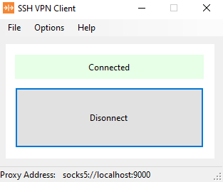

# SSH VPN Client (Lightweight SSH Tunnel)

---

## 📸 Screenshot

---

## English

### Project Description
This is a small and lightweight SSH VPN client that allows you to connect to an SSH server and create a secure SOCKS5 tunnel.

The project is focused on simplicity, stability, and personal daily use.

### Free and Open
This application is **completely free**.
There are no limitations, subscriptions, or paid features.

### Open for Development
This project is open to developers who want to:
- Improve the existing code
- Add new features
- Refactor or clean up the codebase

Feel free to fork the repository and submit pull requests.

### Requirements
To run this application, you need:

- **.NET 9 Runtime**
- Windows operating system

### Vision
Hope for a **free and open internet** 🌍

---

## فارسی

### توضیح پروژه
این پروژه یک کلاینت VPN سبک و ساده مبتنی بر SSH است که با استفاده از آن می‌توانید یک تونل امن SOCKS5 ایجاد کنید.

تمرکز پروژه روی سادگی، پایداری و استفاده‌ی شخصی روزمره است.

### کاملاً رایگان
این برنامه **کاملاً رایگان** است و هیچ محدودیتی برای استفاده ندارد.

### قابل توسعه توسط دیگران
این پروژه برای توسعه‌دهندگان باز است و می‌توانید:
- کد را بهبود دهید
- قابلیت‌های جدید اضافه کنید
- ساختار پروژه را تمیزتر کنید

می‌توانید مخزن را Fork کرده و Pull Request ارسال کنید.

### پیش‌نیاز اجرا
برای اجرای برنامه نیاز دارید به:

- **.NET 9 Runtime**
- سیستم‌عامل ویندوز

### هدف
به امید **اینترنتی آزاد و بدون محدودیت** 🌍

---

## 📄 License

This project is licensed under the **MIT License**.
See the [LICENSE](./LICENSE) file for more information.
